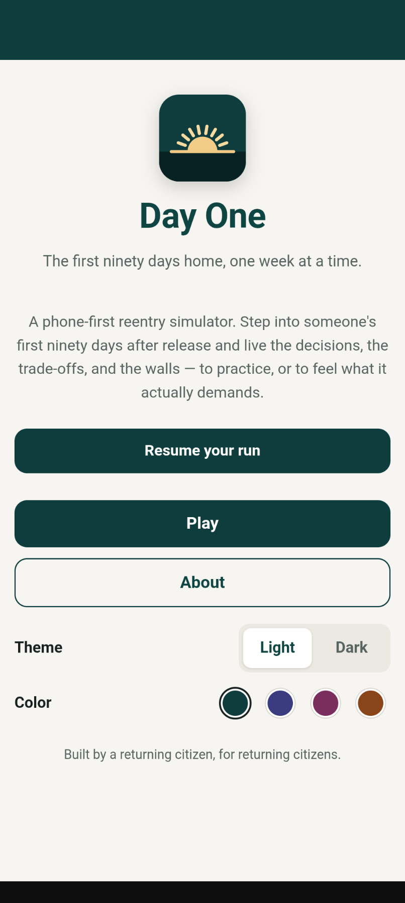
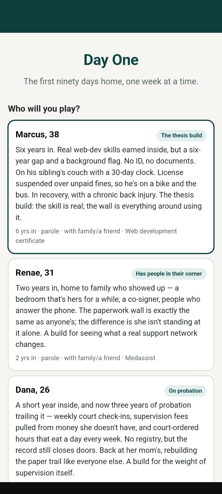
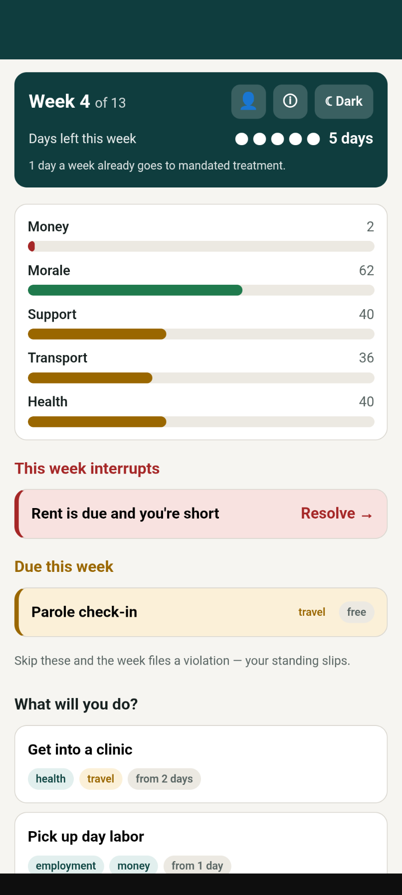
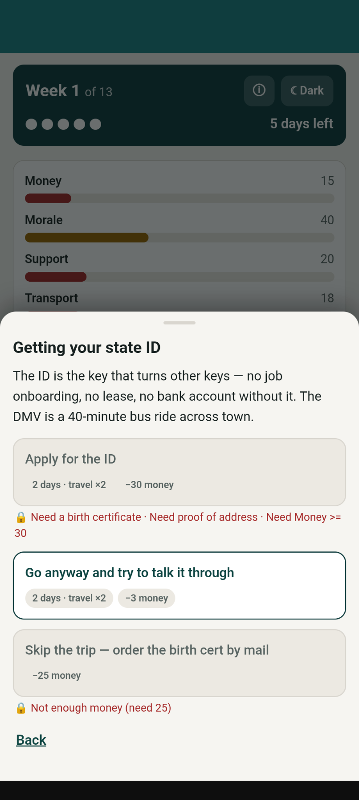
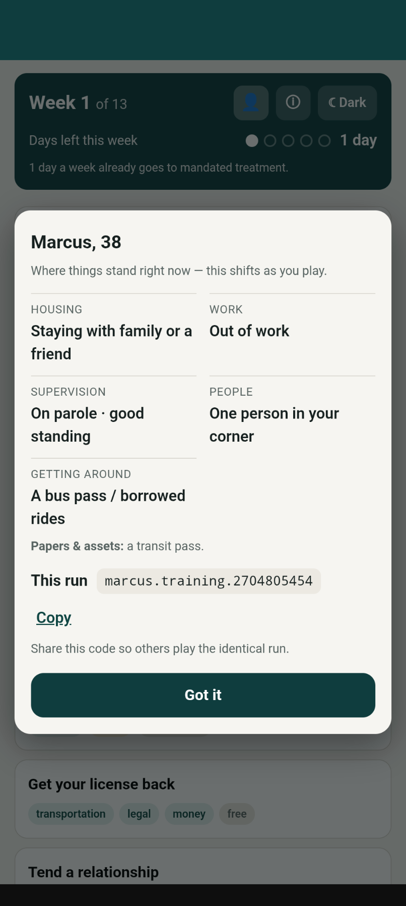
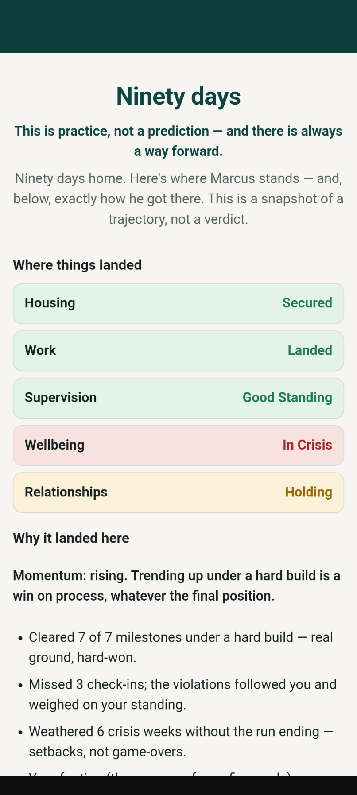

# Day One

A phone-first **reentry simulator**: you take a character recently released from
prison and live the first ninety days home — finding an ID, housing, work, and
footing — one weekly turn at a time, against a budget of time that never quite
covers everything that's due.

Built as a lightweight, installable, offline-capable **React PWA**. It's
deliberately not a high-graphics video game — think Oregon Trail meets the "Spent"
poverty simulator: data-driven, decision-heavy, light enough to run on an old
Android phone on a metered connection.

It serves two audiences, weighted equally:

- **Returning citizens (RCs)** preparing for release — to set realistic
  expectations and rehearse hard decisions in a safe place.
- **Outsiders** — staff, volunteers, the public — to understand, in their gut,
  what reentry actually demands.

Built by a returning citizen, for returning citizens — the barriers modeled here
are remembered, not imagined.

**Live:** [dayone-sim.app](https://dayone-sim.app) · [default URL](https://day-one-a7fs5.ondigitalocean.app)

> **New here?** Start with [`docs/ABOUT.md`](docs/ABOUT.md) — a plain-language tour
> of what Day One is and how it works. **Design source of truth:**
> [`docs/DESIGN.md`](docs/DESIGN.md). Build roadmap: [`docs/SPRINTS.md`](docs/SPRINTS.md).
> Developer notes & per-sprint status: [`DEVELOPMENT.md`](DEVELOPMENT.md).

---

## Screenshots

| The landing page | Who will you play? |
| :---: | :---: |
|  |  |
| **The weekly turn** | **The document catch-22** |
|  |  |
| **Your situation** | **Ninety days — the debrief** |
|  |  |

The right next move is visible but **locked**, with the reason spelled out (*need a
birth certificate · need proof of address · need money ≥ 30*) — that gap is the
simulation. There's no "you lost" screen: a run ends in a **debrief** that scores
trajectory and decisions, not just where you finished.

---

## Status

**Live in production**, released through
**[v1.3.0](https://github.com/brett-buskirk/day-one/releases/tag/v1.3.0)**. The v1.0.0
foundation — Sprints 0–5 — is summarized below; every release since (see
[`CHANGELOG.md`](CHANGELOG.md)) layered on more: the "Where to get help" resource
directory, three more archetypes, housing & transport **ladders**, **random life
events**, a reunifying-parent **custody arc**, and a redesigned character-select.
Playable end-to-end:

- **Sprint 0** — scaffold + content pipeline (YAML → validated JSON).
- **Sprint 1** — the walking skeleton: a full ~13-week run to a debrief.
- **Sprint 2** — incidents, pool-floor crises, obligation enforcement, and
  trajectory-aware, mode-aware scoring.
- **Sprint 3** — mode onboarding, three character archetypes (incl. a registry
  deep-end build) with character select, run export/import, the resource hook, and
  an accessibility pass.
- **Sprint 4** — a broadened corpus (events across every track) and an economy
  balance pass.
- **Sprint 5 (depth / v2 candidates)** — a landing page + About screen, the registry employment wall,
  decision-quality scoring, a recurring monthly economy, probation as a full
  supervision path, the **Longtimer** build (with a technology gap and mental-health
  rules), an in-game info card, **facilitator/classroom scenario codes**, and
  **random character generation**.

Currently: **9 archetypes + a generated random build**, **38 events**, two modes
(training / empathy), light/dark + accent theming, and **116 passing tests**. What
you can do today:

- From the landing page, read the About or jump straight to Play. Pick one of nine
  builds — **Marcus** (the thesis build), **Renae** (supported), **Dana** (on
  probation), **Theo** (the registry deep-end), **Ray** (the longtimer — 24 years
  inside, with a technology gap and mental-health weight), **Cal** (a "max-out"
  release: no supervision, but no support or structure either), **Jaylen** (a young
  first-timer, walled by inexperience rather than a record), **Tasha** (a parent
  fighting to regain custody — a family-court arc), or **Gloria** (the "has it all"
  contrast build: a job, savings, and support all intact) — or **Surprise me** for a
  randomly generated person, then play ~13 weeks to a narrative debrief.
- Play a **shared run** — a `character.mode.seed` code makes everyone's run identical,
  so a room can compare how their choices diverged.
- Feel the document catch-22, hit crises that branch instead of ending the run,
  keep (or miss) a weekly check-in, watch the registry wall reshape housing and
  work, and feel money move month to month (benefits in, fees and fares out).
- Get blindsided, once a run, by an unexpected **life event** — a loss or a blessing
  alike — that lands at a moment you can't predict, the way reentry actually goes.
- Install it to a phone, play offline, close the tab and resume, switch theme, end
  a run early, and export/import a run.
- **Find real help** — a "Where to get help" screen (free, national reentry resources)
  is one tap from the landing page, the in-game info card, and the end-of-run debrief.

What's planned next — new archetypes, deeper content, a facilitator guide — lives in
[`ROADMAP.md`](ROADMAP.md). Lower-level open threads (content breadth, and
local/jurisdiction resource listings on top of the shipped national baseline) are at
the bottom of [`DEVELOPMENT.md`](DEVELOPMENT.md).

---

## Quick start

```bash
npm install
npm run dev        # validates + compiles content, then serves at http://localhost:5173
```

| Goal | Command | Notes |
| ---- | ------- | ----- |
| Play / develop (hot reload) | `npm run dev` | http://localhost:5173 |
| Test PWA install + offline | `npm run build && npm run preview` | http://localhost:4173 — the service worker only runs in the production build |
| Run the test suite | `npm test` | Vitest (engine + end-to-end playthrough) |
| Typecheck | `npm run typecheck` | `tsc -b`, no emit |
| Compile content only | `npm run build:content` | YAML → `src/content/corpus.generated.json` |
| Regenerate PWA icons | `npm run icons` | procedural sunrise PNGs |

The content pipeline runs automatically on `dev`/`build`; in dev it re-compiles
and reloads whenever you edit anything under `content/`, `schema/`, or the flag
registry.

---

## How it works

Four parts, one direction of dependency — content and engine know nothing about
the UI (see `docs/DESIGN.md` §3):

- **Content corpus** (`content/*.yaml`) — events and character origins authored as
  data. A build step (`scripts/compile-content.mjs`) loads all YAML, validates
  every event against [`schema/event.schema.json`](schema/event.schema.json) with
  AJV, **fails the build** on invalid content or an unknown flag reference, and
  compiles a JSON bundle the app imports (and the service worker precaches, so a
  run works fully offline).
- **Simulation engine** (`src/engine/`, no React) — pure functions over plain,
  JSON-safe state: the weekly turn loop, the five resource pools, the
  transportation slot multiplier, weighted outcome resolution, effect application,
  threshold-triggered crises, obligation enforcement, and the debrief/scoring. The
  RNG is a seedable `mulberry32` threaded through state, and runs are serializable
  (`serializeRun` / `loadRun`) — same seed + same inputs ⇒ same run.
- **Game state** — the serializable snapshot the engine reads and writes.
- **UI** (`src/ui/`, React) — a mobile-first, single-column, accessible shell that
  renders state and collects taps. Saved runs persist to IndexedDB (Dexie) so you
  can close the tab and resume.

Two principles run through it: **barriers are data preconditions** (the catch-22 is
a button you can see and can't press yet), and there is **no "you lost" screen** —
setbacks are crises with branches, and the run is scored on trajectory and
decisions under constraint, not just final position.

---

## Project structure

```
day-one/
├── docs/
│   ├── ABOUT.md                  plain-language overview (start here)
│   ├── DESIGN.md                 the design source of truth
│   ├── DEPLOYMENT.md             self-host / Docker / DigitalOcean guides
│   ├── SPRINTS.md                build roadmap
│   └── screenshots/              images used in this README
├── schema/
│   └── event.schema.json         JSON Schema authored events validate against
├── content/
│   ├── characters/*.yaml         the five archetypes (origins)
│   ├── events/*.yaml             authored events (the "world")
│   └── resources.yaml            reentry resources (national baseline + local hook)
├── scripts/
│   ├── compile-content.mjs       YAML → validated JSON pipeline (shared)
│   ├── build-content.mjs         CLI wrapper for the pipeline
│   └── make-icons.mjs            procedural PWA icon generator
├── src/
│   ├── engine/                   pure, framework-agnostic simulation engine
│   │   ├── types.ts              canonical contracts
│   │   ├── engine.ts             turn loop, resolution, effects, serialization
│   │   ├── chargen.ts            origin → opening game state
│   │   ├── predicate.ts          safe predicate evaluator (no eval)
│   │   ├── rng.ts                seedable mulberry32
│   │   ├── debrief.ts            ending profile + trajectory + mode framing
│   │   ├── tuning.ts             balance knobs (slots, multipliers, triggers)
│   │   ├── flags.{ts,json}       the flag registry (single source of truth)
│   │   └── *.test.ts             engine, per-sprint, and playthrough tests
│   ├── ui/                       React screens & components (Landing, About,
│   │                             Start, Onboarding, Turn, EventDetail, Debrief, Help)
│   ├── content/corpus.ts         typed access to the compiled corpus
│   ├── theme.ts                  light/dark + accent theming
│   ├── db.ts                     Dexie save/resume
│   ├── App.tsx / main.tsx        app shell + SW registration
│   └── styles.css                mobile-first, accessible, themeable styling
└── public/
    ├── manifest.webmanifest      PWA manifest (hand-authored)
    ├── favicon.svg               sunrise favicon
    └── icons/                    generated PWA icons
```

The repo root also holds the deploy + meta files: `Dockerfile` and `nginx.conf`
(self-host), `.do/app.yaml` (DigitalOcean), `LICENSE`, `CONTRIBUTING.md`,
`SECURITY.md`, and CI + issue/PR templates under `.github/`.

---

## Stack

React 19 · TypeScript · Vite 7 · `vite-plugin-pwa` (Workbox) · Dexie (IndexedDB) ·
AJV (content validation) · js-yaml · Vitest.

---

## Deployment

**Live** at **https://dayone-sim.app** (DigitalOcean App Platform; merging a PR to
the protected `main` branch auto-builds and redeploys).

It's a static PWA, so it hosts anywhere static. The whole deployable artifact is the
`dist/` folder:

```bash
npm ci && npm run build      # → dist/  (serve with any static host / nginx)
```

[`docs/DEPLOYMENT.md`](docs/DEPLOYMENT.md) has step-by-step paths for **self-hosting
with nginx**, **Docker** (`docker build -t day-one . && docker run -p 8080:80 day-one`
— no Node needed on the host, via the included [`Dockerfile`](Dockerfile) +
[`nginx.conf`](nginx.conf)), and **DigitalOcean App Platform** (incl. the DNS notes).

---

## Design north stars

If a build decision ever conflicts with one of these, this list wins (expanded in
`docs/DESIGN.md`):

1. **Setbacks, not game-overs.** Running out of money is a crisis with branches,
   not death. Scoring rewards trajectory and good decisions under constraint.
2. **Barriers are preconditions, not prose.** Every obstacle is enforced in data.
3. **Two audiences, one engine.** Training and empathy modes share the engine and
   corpus; they differ in onboarding, difficulty defaults, debrief framing, and a
   single `hardFail` flag.
4. **Group-ready for free.** Deterministic (seedable RNG) and serializable runs.
5. **Phone-first, offline, accessible.** Old Android, metered plan, bad Wi-Fi.

---

## Contributing

`main` is protected — work on a branch, open a PR, let CI (build + typecheck +
tests) pass, then merge. See [`CONTRIBUTING.md`](CONTRIBUTING.md) and, for working
in the codebase, [`CLAUDE.md`](CLAUDE.md).

## License

[MIT](LICENSE) © Brett Buskirk. Use it, deploy it, adapt it — including at your own
organization. If it helps people coming home, it's doing its job.
